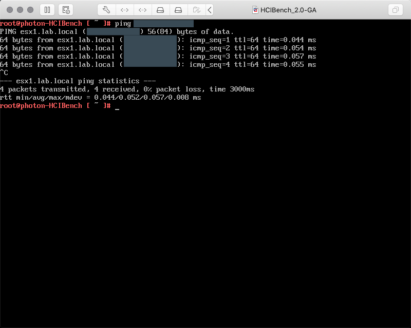
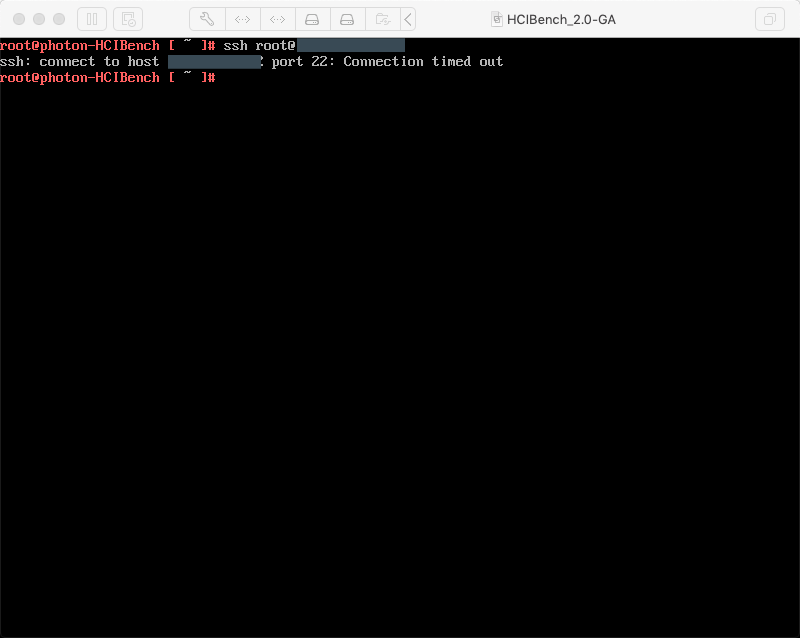

# Networking

## Unable to SSH to \<host\>, please check if your network allow SSH to go through

This section lists basic steps to troubleshoot an error during validation stating a problem with SSH.

1. On the ESX hosts insure the following services are running:

  * ESXi Shell
  * SSH

  <div style="background-color:rgba(0, 0, 0, 0.0470588); text-align:left; vertical-align: middle; padding:20px 20px 20px 20px;">
    
  </div>


2. From HCIBench insure you can ping the host by IPs. This step validates:

  * Switching
  * Routing (N.B. If hcibench and the ESX hosts are on different subnets.)
  * IP assignment
  * ACL (N.B. Only confirms ICMP.)

  N.B. If this test fails, there are configuration issues with the underlying network. In most cases there are too many possible causes and environment specific equipment to provide a simple workaround; a network specialist should investigate and validate the network configuration to insure basic connectivity.

  <div style="background-color:rgba(0, 0, 0, 0.0470588); text-align:left; vertical-align: middle; padding:20px 20px 20px 20px;">
    
  </div>


3. If hostnames are used, from HCIBench insure you can resolve ESX hostnames. This step confirms DNS is configured and working correctly.

   If the previous steps are working but this step fails, DNS entries for the ESX hosts are not available in the DNS server(s) configured in HCIBench. A DNS can investigate the DNS records and zone delegation, or there are a few easy workarounds:

     * Insure HCIBench is using the same DNS servers used by the vSphere environment.
     * In HCIBench add manual entries in the ```/etc/hosts``` file for every ESX host and vCenter.

  <div style="background-color:rgba(0, 0, 0, 0.0470588); text-align:left; vertical-align: middle; padding:20px 20px 20px 20px;">
    
  </div>


4. From HCIBench insure you can SSH to the SSH hosts. This step validates if there are any ACL or firewall rules that might be affecting SSH connectivity or traffic with TCP port 22.

   N.B. If this test fails, there are configuration issues with the underlying network. A network specialist should investigate and validate the network configuration to insure there the required ACL or firewall rules are configured.

  <div style="background-color:rgba(0, 0, 0, 0.0470588); text-align:left; vertical-align: middle; padding:20px 20px 20px 20px;">
    
  </div>
